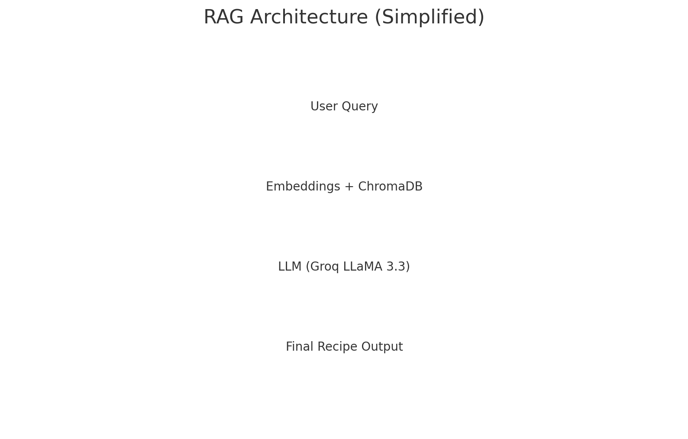

# Indian Recipes RAG (Retrieval-Augmented Generation)


This is an AI-powered **Recipe Assistant** built using **RAG (Retrieval-Augmented Generation)** on top of a dataset of **~6000 Indian recipes sourced from Kaggle**.

It retrieves relevant recipes based on user queries (dish name, ingredients, cuisine type, spice level, dietary preference, etc.) and generates detailed cooking instructions using an LLM.

---

## 🔥 Key Features

- Uses a dataset of **6000+ Indian recipes from Kaggle**
- Semantic search using Embeddings + **ChromaDB vector store**
- Context-aware response generation using **Groq LLaMA 3.3**
- Returns:
  - Recipe name
  - Ingredients (clean format)
  - Step-by-step cooking instructions
- CLI interface for interactive usage
- Efficient recipe retrieval even with incomplete input  
  _(e.g., “paneer with spinach”, “spicy chicken dish”)_

---

## 🧠 Tech Stack

| Component | Technology |
|----------|------------|
| LLM | Groq LLaMA 3.3 |
| Embeddings | Sentence Transformers (MiniLM-L6-V2) |
| Vector DB | ChromaDB |
| Language | Python |
| Dataset | Kaggle Indian Food Recipes |

---

## 🚀 Setup Instructions

### 1️⃣ Clone project

```bash
git clone <your-repo-url>.git
cd indian-recipes-rag
```

### 2️⃣ Install dependencies

```bash
pip install -r requirements.txt
```

### 3️⃣ Add dataset

Place the CSV file inside:

```
data/Cleaned_Indian_Food_Dataset.csv
```

(Any Kaggle version with ~6000 Indian recipes works — rename accordingly)

### 4️⃣ Add your Groq API key

```bash
export GROQ_API_KEY="your_key_here"
# Windows PowerShell: 
# $env:GROQ_API_KEY="your_key_here"
```

### 5️⃣ Run the app

```bash
python recipes_rag.py
```

### Optional: Rebuild vector index

```bash
python recipes_rag.py --rebuild-index
```

---

## 📝 Example Queries

- `What can I cook with rice and curd?`
- `Spicy chicken curry`
- `Gujarati snacks`
- `Paneer with spinach`

---

## 📌 Notes

- The system auto-detects ingredient + instruction fields from the CSV
- The vector store is saved locally in `chroma_db/`
- You can easily extend it with a GUI (Streamlit / Gradio)

---

## 👨‍💻 Developed By

**Harsh Patel**  
Using ~6000+ Kaggle Indian Recipes + RAG + Groq LLM

---

### ⭐ Future Enhancements

- Voice-based recipe search
- Nutritional breakdown per recipe
- Image-based retrieval (upload ingredients photo)
- Multi-cuisine support


---

## 🧱 Architecture Overview




---

If you find this project useful, please ⭐ the repo!
